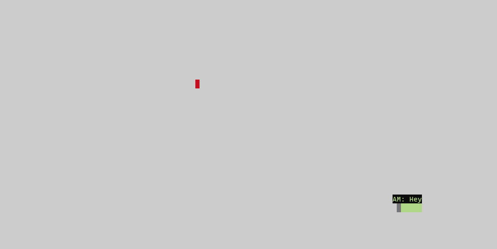

# Snake Client Project

Snake game is a very popular video game. It is a video game concept where the player maneuvers a dot and grows it by ‘eating’ pieces of food. As it moves and eats, it grows and the growing snake becomes an obstacle to smooth maneuvers. The goal is to grow it to become as big as possible without bumping into the side walls, or bumping into itself, upon which it dies.

This is simply a multiplayer take on the genre.

Before you can run this client, you will need to be running the server side which you can download and install from here. 

## Purpose

**_BEWARE:_ This client was published for learning purposes. It is _not_ intended for use in production-grade software.**

This project was created and published by me as part of my learnings at Lighthouse Labs. 

## Final Product

## Getting Started

- Follow steps inside the snek server repo to run the server side
- Run the development snake client using the `node play.js` command.

## Documentation

The following JavaScripts with functions are currently implemented:

* `client` : Snake client project directory
  * `connect` : establishes a connection with the game server, with IP and PORT.

  * `setEncoding("utf8")` : interpret incoming data as text.

* `constants` : Snake constants configuration value of the project directory.

* `input` : module which will focus on managing the user input.
  * `movementCommand` : user input commands

  * `setupInput` : module listening for user input via the keyboard.

   * `handleUserInput` : Handles when the user Ctrl + C to exit.

 * `play` : Module to run the snake game. 

 ## Test
This project is tested using node.js and specifically design to connect to https://github.com/lighthouse-labs/snek-multiplayer for testing. 